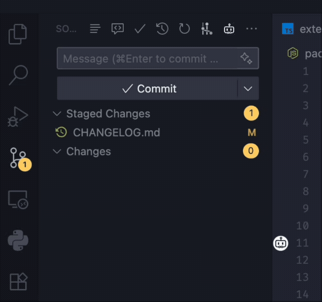
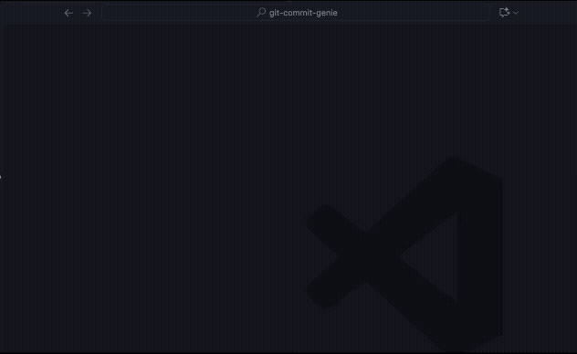

<div align="center">

# Git Commit Genie

Chinese version: [中文说明](./docs/README.zh-CN.md)

</div>

## Overview

Git Commit Genie analyzes your staged Git diff and generates high‑quality Conventional Commits style messages using mainstream LLM providers (OpenAI / DeepSeek / Anthropic / Gemini). Features intelligent repository analysis that understands your project structure and tech stack to provide better context for commit generation. Supports optional multi‑step chain prompting and user template strategy to improve structural consistency and style alignment.

## Usage


## Format

By default, generated commit messages follow the Conventional Commits 1.0.0 specification. See the spec: https://www.conventionalcommits.org/en/v1.0.0/

Basic format:
```
<type>[optional scope]: <description>

[optional body]

[optional footer(s)]
```

## Tips

- Small or trivial commits: prefer a lightweight, fast model to speed up generation and reduce token usage.
- Large, multi‑file commits: consider switching to a stronger model for better analysis and structure.
- You can switch models anytime via "Git Commit Genie: Manage Models".

## Core Features

| Feature                         | Description                                                                                                                                                                                               |
| ------------------------------- | --------------------------------------------------------------------------------------------------------------------------------------------------------------------------------------------------------- |
| Multi‑provider LLM support      | Supports OpenAI, DeepSeek, Anthropic, Gemini.                                                                                                                                                             |
| Repository Intelligence         | Automatically analyzes project structure, tech stack, and architecture to provide context for better commit messages; supports manual refresh, real-time updates, and manual editing of analysis reports. |
| Chain Prompting Mode            | Optional multi‑step pipeline: per‑file summaries → structured synthesis → validation & minimal fix‑ups (improves accuracy & template adherence).                                                          |
| User Template Strategy          | Built-in template selection and creation, supports workspace and user data directory storage, extracts strategy affecting structure, required footers, and vocabulary preferences.                        |
| Conventional Commit Enforcement | Header validation (type, optional scope, optional `!`, ≤ 72 chars, imperative, no trailing period).                                                                                                       |
| Diff Awareness                  | Only staged changes are analyzed; intelligently classifies type (`feat`, `fix`, `docs`, `refactor`, etc.).                                                                                                |
| Token & Rate Safeguards         | Retry with backoff; local soft limits (Gemini); parallelism control for chain mode.                                                                                                                       |
| Status Bar Integration          | Shows current model and analysis status, click to access feature menu.                                                                                                                                    |
| Cancellation                    | Cancel in‑progress generation directly from the SCM title bar button.                                                                                                                                     |
| Secure Secret Storage           | API keys stored in VS Code secret storage (not in settings JSON).                                                                                                                                         |
| Internationalization            | Built‑in English, Simplified Chinese, Traditional Chinese, and more.                                                                                                                                      |

## How It Works

1. You stage your changes.
2. Run command: `Git Commit Genie: AI Generate` (SCM toolbar button or Command Palette).
3. If Chain Prompting is enabled:
	- Generate file‑level summaries in parallel
	- Synthesize & classify change type and scope.
	- Apply template policy (if valid) to shape body & footers.
	- Run structural + style self‑check and minimal fix‑ups.
4. Result is injected into the repository input box—review / tweak / commit.

If chain prompting is disabled: single prompt (lower latency, less structural & stylistic richness).

## Installation

1. Install from VS Code Marketplace (search "Git Commit Genie") or manually via packaged `.vsix`.
2. Open the Command Palette → `Git Commit Genie: Manage Models` to configure provider, API key, and model.
3. (Optional) Run “Git Commit Genie: Select/Create Template” to create or choose a template for this repo (stored in `.gitgenie/templates`) or globally (user data folder).

## Requirements

| Requirement    | Notes                                                  |
| -------------- | ------------------------------------------------------ |
| VS Code        | Engine `^1.103.0` or newer.                            |
| Git Extension  | Bundled (`vscode.git`); must be enabled.               |
| Network Access | Needed to call chosen LLM provider.                    |
| API Key        | For each provider you intend to use (stored securely). |

## Configuration (Settings)

All settings are under: `Git Commit Genie`.

| Setting                                             | Type    | Default | Description                                                                                                                                                                                                                  |
| --------------------------------------------------- | ------- | ------- | ---------------------------------------------------------------------------------------------------------------------------------------------------------------------------------------------------------------------------- |
| `gitCommitGenie.autoStageAllForDiff`                | boolean | false   | Only when the staging area is empty: temporarily stage all changes to build the diff, then restore your staging state. Use with caution—this may include unrelated changes in the prompt.                                    |
| `gitCommitGenie.chain.enabled`                      | boolean | false   | Enable multi-step chain prompting for commit generation (It makes the generated commit messages more detailed and accurate, and better aligns with the user's template, but it will increase latency and token consumption). |
| `gitCommitGenie.chain.maxParallel`                  | number  | 2       | Maximum parallel LLM calls used by chain prompting across all providers. Increase carefully to avoid provider rate limits.                                                                                                   |
| `gitCommitGenie.llm.maxRetries`                     | number  | 2       | Max retry attempts for API request failures.                                                                                                                                                                                 |
| `gitCommitGenie.llm.temperature`                    | number  | 0.2     | Temperature (0–2). Default 0.2.                                                                                                                                                                                              |
| `gitCommitGenie.repositoryAnalysis.enabled`         | boolean | true    | Enable repository analysis to provide better context for commit message generation.                                                                                                                                          |
| `gitCommitGenie.repositoryAnalysis.excludePatterns` | array   | []      | File patterns to exclude from repository analysis scanning (gitignore-style).                                                                                                                                                |
| `gitCommitGenie.repositoryAnalysis.updateThreshold` | number  | 10      | Number of commits after which to update the repository analysis.                                                                                                                                                             |
| `gitCommitGenie.repositoryAnalysis.model`             | enum    | general | Model used for repository analysis. Pick any supported model across providers; the provider automatically switches to match your selection. Choose “Use general provider model” to reuse your main commit message model.      |
| `gitCommitGenie.commitLanguage`                     | string  | `auto`  | Target language for generated commit messages. Options: `auto`, `en`, `zh-CN`, `zh-TW`, `ja`, `ko`, `de`, `fr`, `es`, `pt`, `ru`, `it`.                                                                                      |
| `gitCommitGenie.typingAnimationSpeed`               | number  | 15      | Speed of the commit message box typing animation in milliseconds per character. Set to -1 to disable the animation.                                                                                                          |
| `gitCommitGenie.showUsageCost`                      | boolean | true    | When enabled, a brief notification displays the estimated total cost for the current generation.                                                                                                                             |


## Command List

| Command ID                                   | Title                       | Purpose                                               |
| -------------------------------------------- | --------------------------- | ----------------------------------------------------- |
| `git-commit-genie.generateCommitMessage`     | AI Generate                 | Produce commit message for staged changes.            |
| `git-commit-genie.cancelGeneration`          | Stop                        | Cancel in‑flight generation.                          |
| `git-commit-genie.manageModels`              | Manage Models               | Select provider, enter/replace API key, choose model. |
| `git-commit-genie.toggleChainMode`           | Toggle Chain Prompting      | Quickly enable/disable chain mode.                    |
| `git-commit-genie.selectTemplate`            | Select/Create Template      | Pick or create a commit message template file.        |
| `git-commit-genie.viewRepositoryAnalysis`    | View Repository Analysis    | Quick access to repository analysis report.           |
| `git-commit-genie.refreshRepositoryAnalysis` | Refresh Repository Analysis | Manually refresh repository analysis.                 |
| `git-commit-genie.cancelRepositoryAnalysis`  | Stop Repository Analysis    | Cancel ongoing repository analysis.                   |
| `git-commit-genie.genieMenu`                 | Menu                        | Open Git Commit Genie feature menu.                   |
| `git-commit-genie.openAnalysisJson`          | Open Analysis JSON          | (Developer mode) Open internal analysis JSON file.    |
| `git-commit-genie.showRepositoryCost`        | Show Repository Cost        | Show estimated total usage cost for this repository.  |
| `git-commit-genie.resetRepositoryCost`       | Reset Repository Cost       | Reset the estimated usage cost for this repository.   |

SCM Title Bar: shows "Generate commit message" or "Stop generate" depending on state.

## Template Authoring
Using command `Git Commit Genie: Select/Create Template`to select or create a template file.



When present & non‑empty, Genie attempts to extract a "Template Policy". Two authoring styles:

1. Natural Language bullet preferences.
2. Markdown template authoring.

Full guides: [English](./docs/user-template-guide.md) | [中文](./docs/user-template-guide.zh-CN.md)

Minimum example:
```
Minimal Template
- Always include a body with Summary and Changes.
- Use imperative, no trailing period.
- Always include a `Refs` footer (use `Refs: N/A` when missing).
- Prefer: add, fix, refactor; Avoid: update.
```

## Chain Prompting vs Single Shot

| Mode            | Pros                                                       | Cons                         | When to Use                                              |
| --------------- | ---------------------------------------------------------- | ---------------------------- | -------------------------------------------------------- |
| Chain Prompting | Best structure, template fidelity, classification accuracy | Higher latency & token usage | Larger multi‑file commits; enforce strict template style |
| Single Shot     | Fast, cheaper                                              | Less nuanced structure       | Quick small fix / typo commits                           |

Toggle via command or enable permanently in settings.

## Security & Privacy

- API keys stored via VS Code SecretStorage (not written to disk config in plain text).
- Only staged diffs (file names & hunks) are sent; no untracked or unstaged changes.
- No analytics/telemetry are collected by this extension.

## Troubleshooting

| Symptom                   | Cause                    | Fix                                          |
| ------------------------- | ------------------------ | -------------------------------------------- |
| "No staged changes found" | You haven't staged files | Stage with Source Control view or `git add`. |
| Empty / generic output    | Template unclear         | Attempt to write structured templates.       |
| Frequent 429 / rate limit | Parallelism too high     | Lower `chain.maxParallel`.                   |
| Thinking badge missing    | Thinking disabled        | Toggle via command or setting.               |
| Asked for API key again   | Secret cleared           | Re‑enter via Manage Models.                  |

## License

MIT

## Acknowledgements

- [Conventional Commits](https://conventionalcommits.org/) - https://github.com/conventional-commits/conventionalcommits.org
- OpenAI / DeepSeek / Anthropic / Gemini model ecosystems.

---

Never suffer through writing commit messages again.
