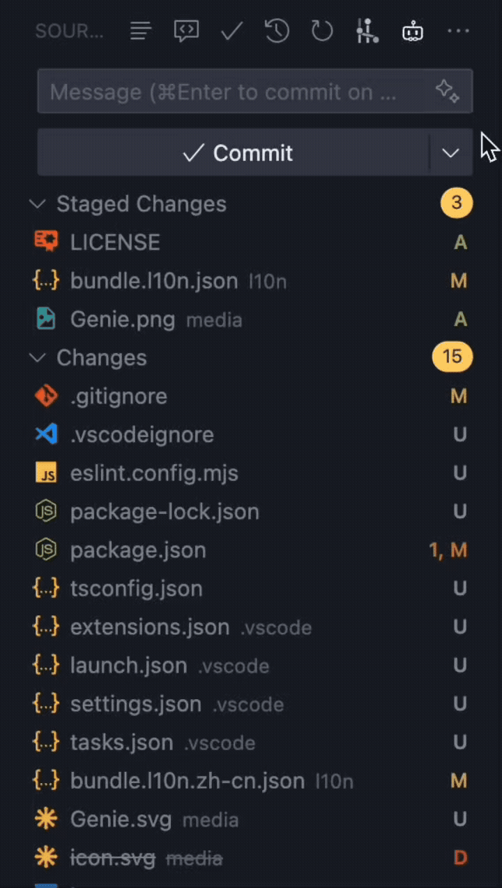

<div align="center">

# Git Commit Genie

Chinese version: [中文说明](./docs/README.zh-CN.md)

</div>

## Overview

Git Commit Genie analyzes your staged Git diff and generates high‑quality Conventional Commits style messages using mainstream LLM providers (OpenAI / DeepSeek / Anthropic / Gemini). Supports optional multi‑step chain prompting and user template strategy to improve structural consistency and style alignment.

## Usage


By default, generated commit messages follow the Conventional Commits 1.0.0 specification. See the spec: https://www.conventionalcommits.org/en/v1.0.0/#specification

Basic format:
```
<type>[optional scope]: <description>

[optional body]

[optional footer(s)]
```

## Tips

- Small or trivial commits: prefer a lightweight, fast model to speed up generation and reduce token usage.
- Large, multi‑file commits: consider switching to a stronger model for better analysis and structure.
- You can switch models anytime via "Git Commit Genie: Manage Models".

## Core Features

| Feature                         | Description                                                                                                                                                             |
| ------------------------------- | ----------------------------------------------------------------------------------------------------------------------------------------------------------------------- |
| Multi‑provider LLM support      | Supports OpenAI, DeepSeek, Anthropic, Gemini.                                                                                                                           |
| Chain Prompting Mode            | Optional multi‑step pipeline: per‑file summaries → structured synthesis → validation & minimal fix‑ups (improves accuracy & template adherence).                        |
| User Template Strategy          | Provide a template file via `gitCommitGenie.templatesPath` to strongly influence body sections, footers, tone, lexicon. Fallback to built‑in rules when absent/invalid. |
| Conventional Commit Enforcement | Header validation (type, optional scope, optional `!`, ≤ 72 chars, imperative, no trailing period).                                                                     |
| Diff Awareness                  | Only staged changes are analyzed; intelligently classifies type (`feat`, `fix`, `docs`, `refactor`, etc.).                                                              |
| Token & Rate Safeguards         | Retry with backoff; local soft limits (Gemini); parallelism control for chain mode.                                                                                     |
| Status Bar Integration          | Shows provider, model, and chain mode badge (`· Chain`). Click to configure.                                                                                            |
| Cancellation                    | Cancel in‑progress generation directly from the SCM title bar button.                                                                                                   |
| Secure Secret Storage           | API keys stored in VS Code secret storage (not in settings JSON).                                                                                                       |
| Internationalization            | Built‑in English + Simplified Chinese.                                                                                                                                  |

## How It Works

1. You stage your changes.
2. Run command: `Git Commit Genie: AI Generate` (SCM toolbar button or Command Palette).
3. Genie collects structured diffs (staged only) via the official Git extension API.
4. If Chain Prompting is enabled:
	- Generate file‑level summaries in parallel (bounded by `gitCommitGenie.chain.maxParallel`).
	- Synthesize & classify change type and scope.
	- Apply template policy (if valid) to shape body & footers.
	- Run structural + style self‑check and minimal fix‑ups.
5. Result is injected into the repository input box—review / tweak / commit.

If chain prompting is disabled: single prompt (lower latency, less structural & stylistic richness).

## Installation

1. Install from VS Code Marketplace (search "Git Commit Genie") or manually via packaged `.vsix`.
2. Open the Command Palette → `Git Commit Genie: Manage Models` to configure provider, API key, and model.
3. (Optional) Create a template file and set `gitCommitGenie.templatesPath` to its absolute path.

## Requirements

| Requirement    | Notes                                                  |
| -------------- | ------------------------------------------------------ |
| VS Code        | Engine `^1.103.0` or newer.                            |
| Git Extension  | Bundled (`vscode.git`); must be enabled.               |
| Network Access | Needed to call chosen LLM provider.                    |
| API Key        | For each provider you intend to use (stored securely). |

## Configuration (Settings)

All settings are under: `Git Commit Genie`.

| Setting                                       | Type    | Default | Description                                                                      |
| --------------------------------------------- | ------- | ------- | -------------------------------------------------------------------------------- |
| `gitCommitGenie.templatesPath`                | string  | ""      | Absolute path to user commit template file (optional).                           |
| `gitCommitGenie.chain.enabled`                | boolean | false   | Enable multi‑step chain prompting. More accurate, higher latency & token cost.   |
| `gitCommitGenie.chain.maxParallel`            | number  | 2       | Max parallel LLM calls during chain prompting. Increase carefully to avoid 429s. |
| `gitCommitGenie.gemini.rpmLimit`              | number  | 8       | Local soft RPM throttle for Gemini. Adjust for higher tiers.                     |
| `gitCommitGenie.gemini.tpmLimit`              | number  | 200000  | Local soft TPM throttle for Gemini.                                              |
| `gitCommitGenie.gemini.expectedTokensPerCall` | number  | 8000    | Heuristic tokens per call for budgeting.                                         |

## Command List

| Command ID                               | Title                  | Purpose                                               |
| ---------------------------------------- | ---------------------- | ----------------------------------------------------- |
| `git-commit-genie.generateCommitMessage` | AI Generate            | Produce commit message for staged changes.            |
| `git-commit-genie.cancelGeneration`      | Stop                   | Cancel in‑flight generation.                          |
| `git-commit-genie.manageModels`          | Manage Models          | Select provider, enter/replace API key, choose model. |
| `git-commit-genie.toggleChainMode`       | Toggle Chain Prompting | Quickly enable/disable chain mode.                    |

SCM Title Bar: shows "Generate commit message" or "Stop generate" depending on state.

## Template Authoring

Provide an absolute path via `gitCommitGenie.templatesPath`. When present & non‑empty, Genie attempts to extract a "Template Policy". Two authoring styles:

1. Natural Language bullet preferences.
2. Embedded JSON Policy block for higher extraction reliability.

Full guides: [English](./docs/user-template-guide.md) | [中文](./docs/user-template-guide.zh-CN.md)

Minimum example:
```
Minimal Template
- Always include a body with Summary and Changes.
- Use imperative, no trailing period.
- Always include a `Refs` footer (use `Refs: N/A` when missing).
- Prefer: add, fix, refactor; Avoid: update.
```

## Chain Prompting vs Single Shot

| Mode            | Pros                                                       | Cons                         | When to Use                                              |
| --------------- | ---------------------------------------------------------- | ---------------------------- | -------------------------------------------------------- |
| Chain Prompting | Best structure, template fidelity, classification accuracy | Higher latency & token usage | Larger multi‑file commits; enforce strict template style |
| Single Shot     | Fast, cheaper                                              | Less nuanced structure       | Quick small fix / typo commits                           |

Toggle via command or enable permanently in settings.

## Security & Privacy

- API keys stored via VS Code SecretStorage (not written to disk config in plain text).
- Only staged diffs (file names & hunks) are sent; no untracked or unstaged changes.
- No analytics/telemetry are collected by this extension.

## Troubleshooting

| Symptom                   | Cause                    | Fix                                              |
| ------------------------- | ------------------------ | ------------------------------------------------ |
| "No staged changes found" | You haven't staged files | Stage with Source Control view or `git add`.     |
| Empty / generic output    | Template unclear         | Add JSON Policy block for clearer extraction.    |
| Frequent 429 / rate limit | Parallelism too high     | Lower `chain.maxParallel`; reduce template size. |
| Chain badge missing       | Chain disabled           | Toggle via command or setting.                   |
| Asked for API key again   | Secret cleared           | Re‑enter via Manage Models.                      |

## License

MIT

## Acknowledgements

- Conventional Commits specification.
- OpenAI / DeepSeek / Anthropic / Gemini model ecosystems.

---

Never suffer through writing commit messages again.
