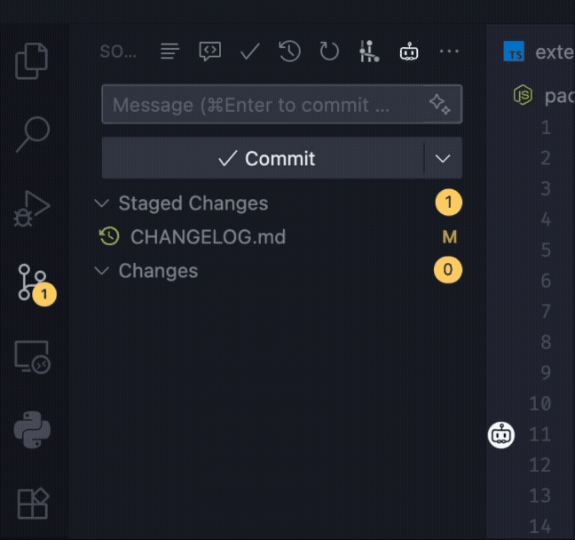
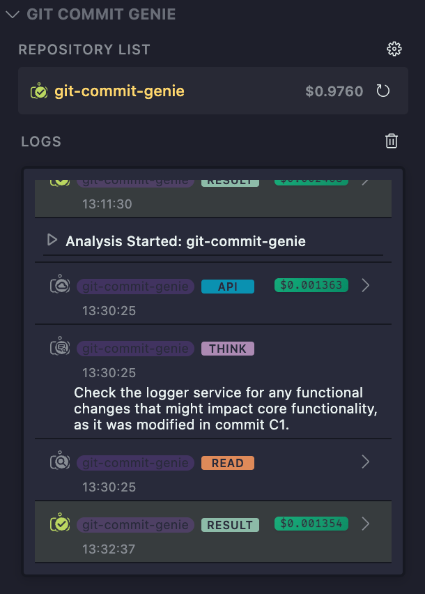
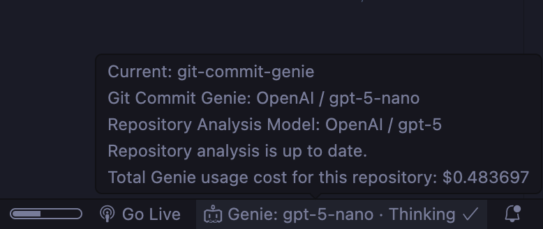

<div align="center">

# Git Commit Genie

English version: [English README](../README.md)

</div>

## 概述

Git Commit Genie 基于已暂存的 Git diff，使用支持的模型适配器（OpenAI、Anthropic、Google Gemini，以及实现 OpenAI Chat Completions 的自定义端点）自动生成高质量的 Conventional Commits 风格提交信息。内置仓库智能分析功能，自动理解项目结构和技术栈，为提交信息生成提供更好的上下文。支持可选"Thinking 模式"（多步推理）与"用户模板"策略，显著提升结构一致性与团队风格统一。

<table style="width: 100%; border-spacing: 10px;">
  <tr>
    <td width="50%" align="center" style="vertical-align: top;">
      <strong>Commit message generate</strong><br/><br/>
      
    </td>
    <td width="50%" rowspan="2" align="center" style="vertical-align: top;">
      <strong>Log dashboard</strong><br/><br/>
      
    </td>
  </tr>
  <tr>
    <td align="center" style="vertical-align: top;">
      <strong>Status Bar Display</strong><br/><br/>
      
    </td>
  </tr>
</table>

## 格式

默认生成的提交信息遵循 Conventional Commits 1.0.0 规范，详情见：https://www.conventionalcommits.org/zh-hans/v1.0.0/

基本格式：
```
<type>[optional scope]: <description>

[optional body]

[optional footer(s)]
```

## Tips

- 少量 / 轻量级提交：优先选择轻巧快速的模型，生成更快、Token 消耗更低。
- 大型 / 多文件提交：再考虑切换更强的模型，以获得更好的理解与结构质量。
- 可随时通过命令面板运行 "Git Commit Genie: Manage Models" 切换模型。
 - 可通过命令面板快速切换 Thinking："Git Commit Genie: 启用 / 禁用链式思考模式"。

## 核心特性

| 特性                     | 说明                                                                                                                                                              |
| ------------------------ | ----------------------------------------------------------------------------------------------------------------------------------------------------------------- |
| 多模型提供商             | 支持 OpenAI、Anthropic、Google Gemini，以及实现 OpenAI Chat Completions 的自定义提供商。                                                                           |
| 仓库智能分析             | AI驱动的仓库分析智能Agent，自主使用智能工具探索代码库；自动理解项目结构、技术栈和架构，为更好的提交信息提供上下文洞察；支持手动刷新、实时更新和可编辑的分析报告。 |
| RAG（检索增强生成）      | 构建本地历史提交信息索引，通过混合检索（稠密向量 + BM25 关键词）检索风格参考，使生成的提交信息与仓库风格保持一致。需要兼容 OpenAI 接口的 Embedding API。支持增量索引与后台向量修复。 |
| Thinking 模式            | 多步：文件级摘要 → 结构化综合 → 校验修复，显著提升准确度与模板贴合度。                                                                                            |
| 用户模板策略             | 内置模板选择和创建功能，支持工作区和用户数据目录，抽取策略影响段落顺序、必填 footers、词汇偏好等。                                                                |
| Conventional Commit 校验 | 头行格式（type(scope)!: desc），长度 ≤ 72，无句号。                                                                                                               |
| Diff 感知                | 仅读取"已暂存"更改；自动推断类型（feat / fix / docs / refactor 等）。                                                                                             |
| 状态栏集成               | 显示当前模型和分析状态，点击可访问功能菜单。                                                                                                                      |
| 生成取消                 | SCM 标题栏按钮可实时取消正在进行的生成。                                                                                                                          |
| 安全存储                 | API Key 使用 VS Code SecretStorage，不写入明文设置。                                                                                                              |
| 国际化支持               | 内置英文、简体中文、繁体中文等多语言支持。                                                                                                                        |
| 阶段进度                 | 在 VS Code 状态栏展示当前 Thinking 阶段，不弹出通知。                                                                                                             |

## 工作流程

1. 暂存（Stage）你的变更。
2. 执行命令：`Git Commit Genie: 生成提交信息`（SCM 顶部按钮或命令面板）。
3. 输出写入仓库提交框，可人工微调后提交。

## 配置项

所有设置位于：`Git Commit Genie`。

| Setting                                             | 类型    | 默认    | 说明                                                                                                                                                 |
| --------------------------------------------------- | ------- | ------- | ---------------------------------------------------------------------------------------------------------------------------------------------------- |
| `gitCommitGenie.autoStageAllForDiff`                | boolean | false   | 仅当暂存区为空时：临时将所有更改加入暂存用于生成 diff，生成后会自动还原暂存状态。谨慎使用，可能会把无关更改包含进提示。                              |
| `gitCommitGenie.chain.enabled`                      | boolean | false   | 启用链式多步提示生成提交信息（使得生成的提交信息更加详准确，且可以更加贴合用户模版，但将增加延迟与 Token 消耗）                                      |
| `gitCommitGenie.chain.maxParallel`                  | number  | 2       | 链式提示并行 LLM 调用最大数量。谨慎增大以避免触发速率限制。                                                                                          |
| `gitCommitGenie.chain.contextWindowTokens`          | integer | 128000  | Thinking 模式使用的模型上下文总窗口。内置模型会自动识别并按注册上限收紧；仅 Custom 端点需要手动设置。输入、输出与安全余量均从这一项自动分配。                    |
| `gitCommitGenie.defaultThinkingLevel`               | enum    | `off`   | 所有支持 thinking 的模型在前台与后台调用中统一使用的全局思考等级，默认关闭；不支持 thinking 的模型始终关闭。Custom OpenAI-compatible 模型自动继承，只有使用非标准参数的端点才需要“管理模型 → 高级 thinking 兼容”。官方模型不支持的等级会直接失败，不会被改写。 |
| `gitCommitGenie.modelThinkingLevels`                | object  | `{}`    | 可选的单模型覆盖。键使用 `provider/model`，值使用思考等级，例如 `{ "openai/gpt-5.4": "high", "custom/Qwen3.5-9B": "low" }`；没有对应键时继承全局配置。一旦创建 execution，该模型解析出的等级会用于所有阶段。Custom 模型还可填写 `VERY_HIGH` 等非空 provider 原生值。 |
| `gitCommitGenie.thinkingBudgets`                    | object  | 见说明  | 仅用于 Anthropic/Google 数字思考预算，以及明确配置了高级本地引擎预算字段的 Custom 端点；普通 OpenAI-compatible 模型提供商无需配置。默认依次为 `1024/4096/10240/32768/65536/131072`。 |
| `gitCommitGenie.llm.maxRetries`                     | number  | 2       | API请求失败最大重试次数。                                                                                                                            |
| `gitCommitGenie.llm.temperature`                    | number  | 1       | Temperature（0–2），默认为 1。部分服务商/模型组合只接受 1；修改该值可能触发 invalid-temperature 错误或导致输出稳定性下降。                                      |
| `gitCommitGenie.rag.enabled`                        | boolean | false   | 启用 RAG 保持 commit message 生成的风格一致性（需要仓库中存在一定数量的历史 commit message 构建本地风格索引）。启用前请先通过"配置 RAG Embedding API Key"命令配置 API Key。 |
| `gitCommitGenie.rag.embedding.baseUrl`              | string  | `""`    | RAG 使用的 embeddings API Base URL，需兼容 OpenAI SDK 的接口形式。                                                                                     |
| `gitCommitGenie.rag.embedding.model`                | string  | `""`    | RAG 使用的 embedding 模型。                                                                                                                           |
| `gitCommitGenie.rag.embedding.dimensions`           | number  | 0       | RAG 使用的可选 embedding 维度（0 = 自动检测）。                                                                                                       |
| `gitCommitGenie.rag.embedding.batchSize`            | number  | 10      | RAG 生成 embeddings 时使用的批大小（1–512）。                                                                                                          |
| `gitCommitGenie.repositoryAnalysis.enabled`         | boolean | true    | 启用仓库分析以提供更好的提交信息生成上下文。                                                                                                         |
| `gitCommitGenie.repositoryAnalysis.excludePatterns` | array   | []      | 仓库分析扫描时要排除的文件模式（gitignore风格）。                                                                                                    |
| `gitCommitGenie.repositoryAnalysis.updateThreshold` | number  | 10      | 更新仓库分析的提交次数阈值。                                                                                                                         |
| `gitCommitGenie.repositoryAnalysis.MaxCount`        | number  | 无上限  | 仓库探索过程中允许的最大分析步数。设置为-1表示无上限（默认）。                                                                                       |
| `gitCommitGenie.repositoryAnalysis.model`           | enum    | general | 用于仓库分析的模型。可选择所有供应商支持的模型，系统将自动切换到该模型所属的服务商；或选择"使用默认模型"以复用主模型。可通过"管理模型"命令进行配置。 |
| `gitCommitGenie.commitLanguage`                     | string  | `auto`  | 生成的提交信息目标语言。选项：`auto`、`en`、`zh-CN`、`zh-TW`、`ja`、`ko`、`de`、`fr`、`es`、`pt`、`ru`、`it`。                                       |
| `gitCommitGenie.typingAnimationSpeed`               | number  | 15      | 提交信息框打字动画速度，单位为每字符毫秒。设置 -1 关闭动画。                                                                                         |  |
| `gitCommitGenie.showUsageCost`                      | boolean | true    | 启用后在生成文本时弹出通知，显示本次生成的估计总费用。                                                                                               |
| `gitCommitGenie.ui.stageNotifications.enabled`      | boolean | true    | 在 VS Code 状态栏显示 Thinking 阶段进度。                                                                                                             |

原生模型推理等级与 `gitCommitGenie.chain.enabled` 的链式多步提交信息生成流程相互独立：前者控制 provider 请求参数，后者控制插件执行的阶段数量。

Custom OpenAI Chat Completions 端点统一使用一个 adapter，并采用 Pi 风格的 thinking 格式。只有完全不支持 thinking 控制的模型才选择 `Unsupported (no parameter)`；它不会发送任何原生 thinking 参数，也无法阻止服务端自行开启 thinking。默认 `openai` 格式发送 `reasoning_effort`；本地 Qwen/vLLM 可选择 `qwen`（`enable_thinking`）或 `qwen-chat-template`（`chat_template_kwargs.enable_thinking`）；通用本地模板选择 `chat-template`。编辑 Custom 模型时还可选择 DeepSeek、OpenRouter、Together、z.ai、Baseten、string-thinking 和 AntLing 格式。思考等级仍由全局配置或单模型覆盖控制，格式只决定如何序列化到端点请求。

Thinking 模式在整个 execution 中只解析一次思考等级：链式各阶段、Agent 轮次、schema 重试、RAG 与仓库 Memory consolidation 都复用同一份 session 绑定配置。官方模型遇到不支持的等级会直接失败，不会自动改写；Custom 端点保持配置原值，若服务端拒绝则直接展示 provider 错误。只有完整提示超过压缩触发线时才会调用 LLM 摘要原始证据；摘要会被后续阶段复用，二次收紧采用确定性压缩，从而减少重复压缩成本。提供商报告输出长度耗尽时不会误判为输入过长：thinking 用尽输出预算时会提示提高 `chain.contextWindowTokens` 或降低思考等级；Custom 只返回含义不明的 `finish_reason=length` 时则明确停止，不盲目重试。


## 命令

在命令面板中搜索以下命令：

- Git Commit Genie: 生成提交信息
- Git Commit Genie: 停止生成（生成进行中可见）
- Git Commit Genie: 管理模型
- Git Commit Genie: 启用 / 禁用链式思考模式
- Git Commit Genie: 选择/新建模板
- Git Commit Genie: 查看仓库分析（以可编辑Markdown形式打开分析）
- Git Commit Genie: 刷新仓库分析（触发新分析）
- Git Commit Genie: 清理仓库分析缓存（清除分析缓存）
- Git Commit Genie: 取消仓库分析（取消分析过程）
- Git Commit Genie: 配置 RAG Embedding API Key（在 SecretStorage 中存储 Embedding API Key）
- Git Commit Genie: 清除 RAG Embedding API Key（删除 Embedding API Key）
- Git Commit Genie: 开始 RAG 索引（为所有历史提交建立风格索引）
- Git Commit Genie: 停止 RAG 索引（取消正在运行的索引任务）
- Git Commit Genie: 菜单
- Git Commit Genie: 查看仓库费用
- Git Commit Genie: 重置仓库费用

SCM 标题栏：根据状态显示“Generate commit message”或“Stop generate”按钮。

## 模板编写
使用命令 `Git Commit Genie: Select/Create Template` 选择或创建模板文件。


模版文件存在且非空时，系统尝试抽取“模板策略”。支持markdown模版编写。

完整指南： [English](./user-template-guide.md) | [中文](./user-template-guide.zh-CN.md)

最小示例：
```
Minimal Template
- Always include a body with Summary and Changes.
- Use imperative, no trailing period.
- Always include a `Refs` footer (use `Refs: N/A` when missing).
- Prefer: add, fix, refactor; Avoid: update.
```

## 安全与隐私

- API Key 使用 SecretStorage，不以明文写入 settings.json， 不会以任何形式上传到互联网，仅保存在本地。
- 仅发送“已暂存 diff”中的文件名与修改上下文；不包括未暂存或未跟踪文件。

## 许可证

MIT

## 致谢

- [Conventional Commits](https://conventionalcommits.org/) - https://github.com/conventional-commits/conventionalcommits.org
- OpenAI / Anthropic / Google Gemini / OpenAI Chat Completions 兼容模型生态

---

让提交信息不再痛苦。
