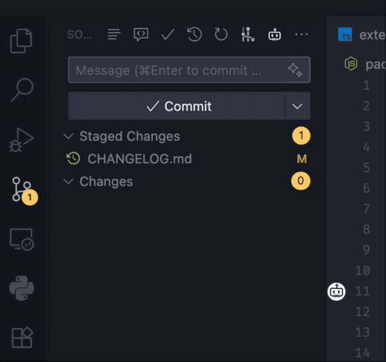

<div align="center">

# Git Commit Genie

English version: [English README](../README.md)

</div>

## 概述

Git Commit Genie 基于已暂存的 Git diff，使用主流大模型（OpenAI / DeepSeek / Anthropic / Gemini）自动生成高质量的 Conventional Commits 风格提交信息。支持可选“链式提示”模式（多步推理）与“用户模板”策略，显著提升结构一致性与团队风格统一。

优势：
- 避免在提交语句格式/措辞上反复纠结。
- 严格符合 Conventional Commits（类型、scope、BREAKING CHANGE）。
- 通过一个简单的模板文件定义 Body / Footers / 语气 / 词汇偏好。
- 支持多模型动态切换，快速选择最适合的提供商与模型。

## Usage


## 格式

默认生成的提交信息遵循 Conventional Commits 1.0.0 规范，详情见：https://www.conventionalcommits.org/zh-hans/v1.0.0/

基本格式：
```
<type>[optional scope]: <description>

[optional body]

[optional footer(s)]
```

## Tips

- 少量 / 轻量级提交：优先选择轻巧快速的模型，生成更快、Token 消耗更低。
- 大型 / 多文件提交：再考虑切换更强的模型，以获得更好的理解与结构质量。
- 可随时通过命令面板运行 “Git Commit Genie: Manage Models” 切换模型。

## 核心特性

| 特性                     | 说明                                                                                                                           |
| ------------------------ | ------------------------------------------------------------------------------------------------------------------------------ |
| 多模型提供商             | 支持 OpenAI、DeepSeek、Anthropic、Gemini等。                                                                                   |
| 链式提示模式             | 多步：文件级摘要 → 结构化综合 → 校验修复，显著提升准确度与模板贴合度。                                                         |
| 用户模板策略             | 通过 `gitCommitGenie.templatesPath` 指向模板文件，抽取策略影响段落顺序、必填 footers、词汇偏好等。无模板或无效时回退默认规则。 |
| Conventional Commit 校验 | 头行格式（type(scope)!: desc），长度 ≤ 72，无句号。                                                                            |
| Diff 感知                | 仅读取“已暂存”更改；自动推断类型（feat / fix / docs / refactor 等）。                                                          |
| Token 与速率保护         | 429 自动退避重试；Gemini 软限本地节流；并发可配置。                                                                            |
| 状态栏集成               | 显示当前 Model，可点击管理。                                                                                                   |
| 生成取消                 | SCM 标题栏按钮可实时取消正在进行的生成。                                                                                       |
| 安全存储                 | API Key 使用 VS Code SecretStorage，不写入明文设置。                                                                           |
| 国际化支持               | 内置英文 + 简体中文。                                                                                                          |

## 工作流程

1. 暂存（Stage）你的变更。
2. 执行命令：`Git Commit Genie: AI Generate`（SCM 顶部按钮或命令面板）。
3. 若开启链式模式：
   - 并行生成文件级摘要
   - 综合分析类型与 scope
   - 应用模板策略（若有效）
   - 结构 + 风格自检与最小修复
4. 输出写入仓库提交框，可人工微调后提交。

未开启链式：使用单轮提示 → 更低延迟，但结构与风格细腻度稍弱。

## 安装

1. VS Code 市场搜索 “Git Commit Genie” 安装，或使用打包 `.vsix` 手动安装。
2. 命令面板运行 `Git Commit Genie: Manage Models` 选择 Provider、输入/替换 API Key、选择模型。
3. （可选）创建模板文件，并在设置中配置绝对路径 `gitCommitGenie.templatesPath`。

## 运行要求

| 项       | 说明                        |
| -------- | --------------------------- |
| VS Code  | 版本需满足引擎 `^1.103.0`。 |
| Git 扩展 | 内置 `vscode.git`，需启用。 |
| 网络访问 | 调用所选 LLM 提供商。       |
| API Key  | 使用的每个提供商都需要。    |

## 配置项（Settings）

所有设置位于：`Git Commit Genie`。

| Setting                                         | 类型    | 默认   | 说明                                                                                                                    |
| ----------------------------------------------- | ------- | ------ | ----------------------------------------------------------------------------------------------------------------------- |
| `gitCommitGenie.autoStageAllForDiff`            | boolean | false  | 仅当暂存区为空时：临时将所有更改加入暂存用于生成 diff，生成后会自动还原暂存状态。谨慎使用，可能会把无关更改包含进提示。 |
| `gitCommitGenie.chain.enabled`                  | boolean | false  | 启用链式多步提示生成提交信息（使得生成的提交信息更加详准确，且可以更加贴合用户模版，但将增加延迟与 Token 消耗）         |
| `gitCommitGenie.chain.maxParallel`              | number  | 2      | 链式提示并行 LLM 调用最大数量。谨慎增大以避免触发速率限制。                                                             |
| `gitCommitGenie.workspaceFiles.enabled`         | boolean | true   | 在提示中包含工作区文件名列表。如果超出Token限制，可关闭此项。                                                           |
| `gitCommitGenie.workspaceFiles.maxFiles`        | number  | 2000   | 要传递的文件名数量上限。超过该上限将进行硬截断。                                                                        |
| `gitCommitGenie.workspaceFiles.excludePatterns` | array   | []     | 附加的 gitignore 风格排除规则                                                                                           |
| `gitCommitGenie.commitLanguage`                 | string  | `auto` | 生成的提交信息目标语言。选项：`auto`、`en`、`zh-CN`、`zh-TW`、`ja`、`ko`、`de`、`fr`、`es`、`pt`、`ru`、`it`。          |
| `gitCommitGenie.typingAnimationSpeed`           | number  | 15     | 提交信息框打字动画速度，单位为每字符毫秒。设置 -1 关闭动画。                                                            |


## 命令列表

| Command ID                               | 标题                   | 作用                                         |
| ---------------------------------------- | ---------------------- | -------------------------------------------- |
| `git-commit-genie.generateCommitMessage` | AI Generate            | 基于已暂存更改生成提交信息。                 |
| `git-commit-genie.cancelGeneration`      | Stop                   | 取消当前生成。                               |
| `git-commit-genie.manageModels`          | Manage Models          | 选择提供商 / 输入或更换 API Key / 选择模型。 |
| `git-commit-genie.toggleChainMode`       | Toggle Chain Prompting | 快速开启/关闭链式模式。                      |
| `git-commit-genie.selectTemplate`        | Select/Create Template | 选择或新建提交信息模板文件。                 |

SCM 标题栏：根据状态显示“Generate commit message”或“Stop generate”按钮。

## 模板编写
使用命令 `Git Commit Genie: Select/Create Template` 选择或创建模板文件。


模版文件存在且非空时，系统尝试抽取“模板策略”。支持：
1. 自然语言偏好描述。
2. markdown模版编写。

完整指南： [English](./user-template-guide.md) | [中文](./user-template-guide.zh-CN.md)

最小示例：
```
Minimal Template
- Always include a body with Summary and Changes.
- Use imperative, no trailing period.
- Always include a `Refs` footer (use `Refs: N/A` when missing).
- Prefer: add, fix, refactor; Avoid: update.
```

## 链式模式 vs 单轮模式

| 模式 | 优点                             | 缺点                 | 适用场景                |
| ---- | -------------------------------- | -------------------- | ----------------------- |
| 链式 | 结构最佳，模板贴合度高，分类更准 | 延迟更高，Token 更多 | 多文件 / 需严格风格统一 |
| 单轮 | 快速，成本低                     | 结构细腻度较低       | 小变更 / 临时修复       |

通过命令或设置切换。

## 安全与隐私

- API Key 使用 SecretStorage，不以明文写入 settings.json， 不会以任何形式上传到互联网，仅保存在本地。
- 仅发送“已暂存 diff”中的文件名与修改上下文；不包括未暂存或未跟踪文件。
- 无遥测 / 分析数据收集。

## 常见问题（Troubleshooting）

| 现象                      | 原因                | 解决                                    |
| ------------------------- | ------------------- | --------------------------------------- |
| "No staged changes found" | 未暂存任何文件      | 使用 Source Control 或 `git add` 暂存。 |
| 生成内容空泛              | 模板不明确          | 加入 JSON Policy 提升可抽取性。         |
| 频繁 429                  | 并行过高 / 模板过大 | 降低 `chain.maxParallel` 或精简模板。   |
| 状态栏无“· Chain”         | 未启用链式          | 使用命令或设置开启。                    |
| 重复要求输入 API Key      | 秘钥被清除          | 重新运行 Manage Models。                |


## 许可证

MIT

## 致谢

- [Conventional Commits](https://conventionalcommits.org/) - https://github.com/conventional-commits/conventionalcommits.org
- OpenAI / DeepSeek / Anthropic / Gemini 模型生态

---

让提交信息不再痛苦。
